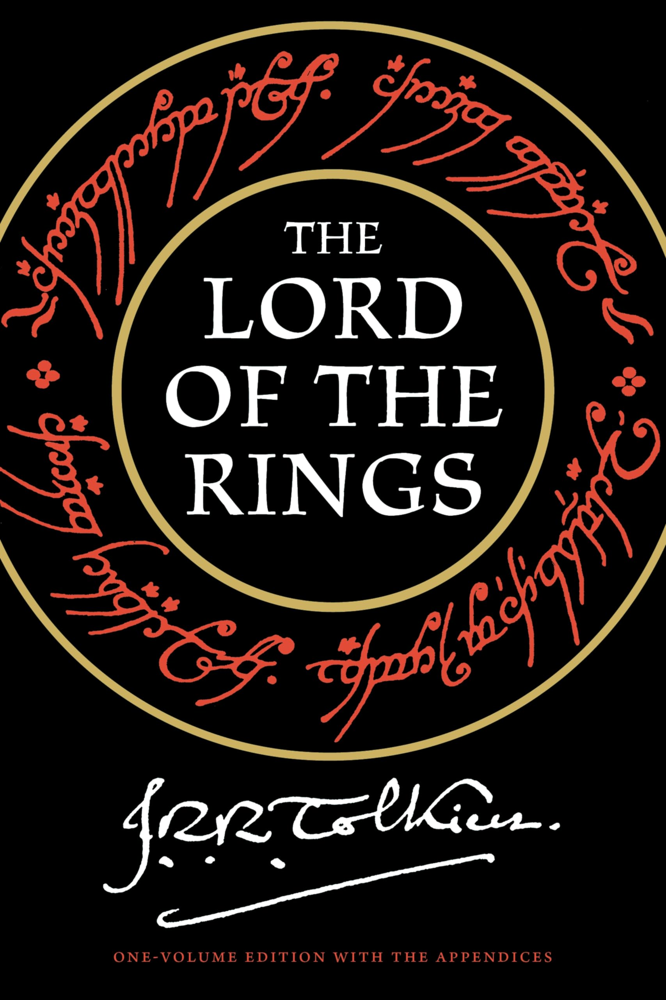
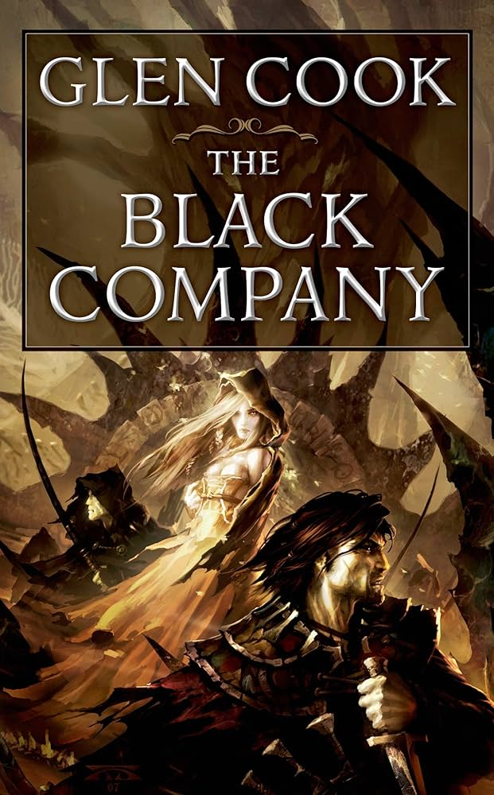
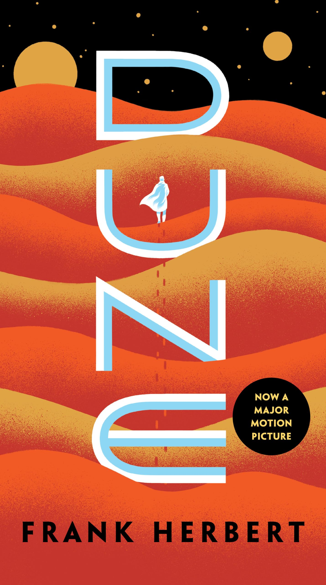

# CPE-322
## John Callinan
**Hello This is my repo for _Design 6_**
>Strive for perfection in everything you do. Take the best that exists and make it better - Sir Henery
---
### My Favorite Board Games in Order
1. [John Company](https://wehrlegig.com/products/john-company-second-edition) by Cole Wehrle
2. [Catan](https://www.catan.com/catan) by Klaus Teuber
3. [Oath](https://ledergames.com/products/oath-chronicles-of-empire-exile?srsltid=AfmBOorVPu3BA_NXiKCY5z23_XF7kgb1A4DJEdP_2zMCM7XTzRXiIfwQ) by Cole Wehrle
---
### Book Series I Like in No Order
- Lord of the Rings by J.R.R Tolkien  
- The Black Company by Glenn Cook 
- Dune by Frank Herbert 
---
### Code
	`print("Hello World")`
