**Hostname Running:**

**Env Running:**

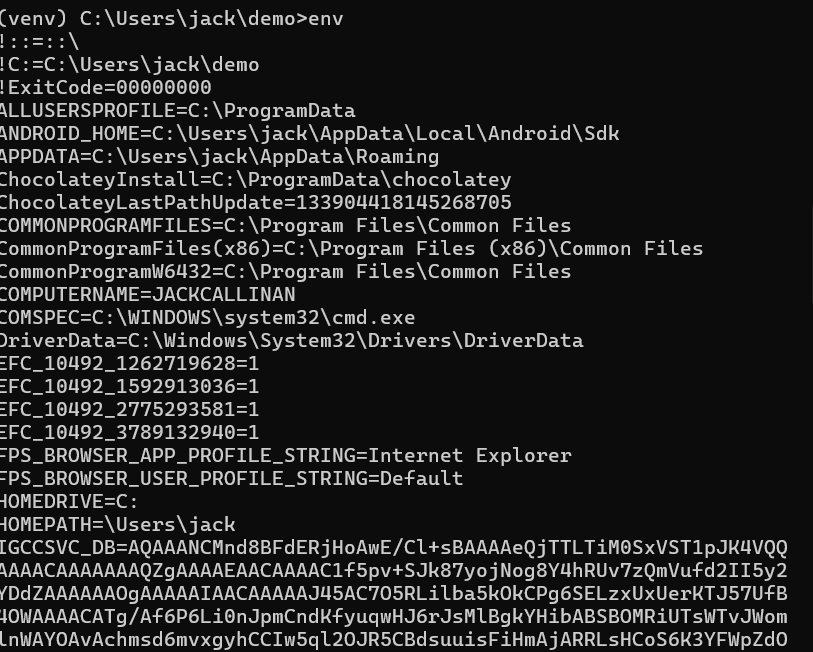

**PS Running:**

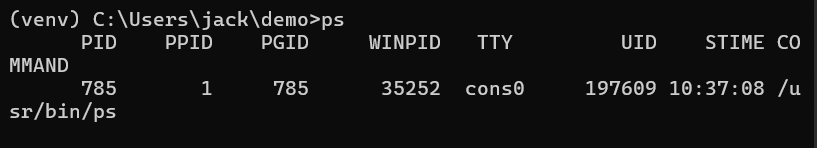

**PWD Running:**

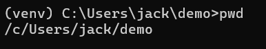

**Git Clone:**

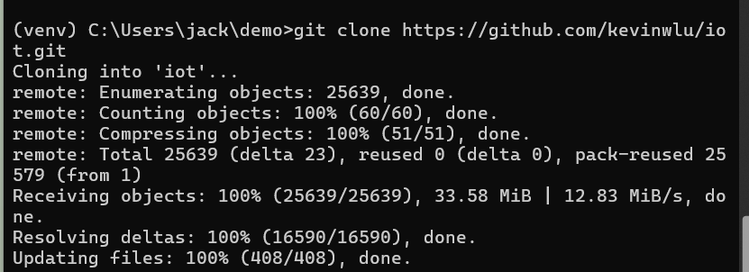

**Checking IOT:**

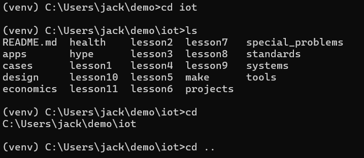

**DF:**

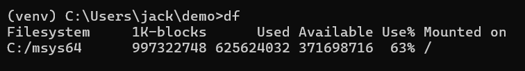

**Making Demo:**

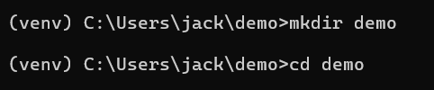

**File2:**

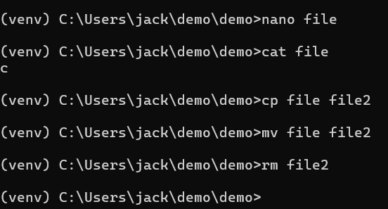

**Uname:**

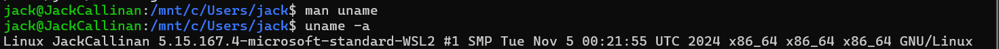

**IPCONFIG:**

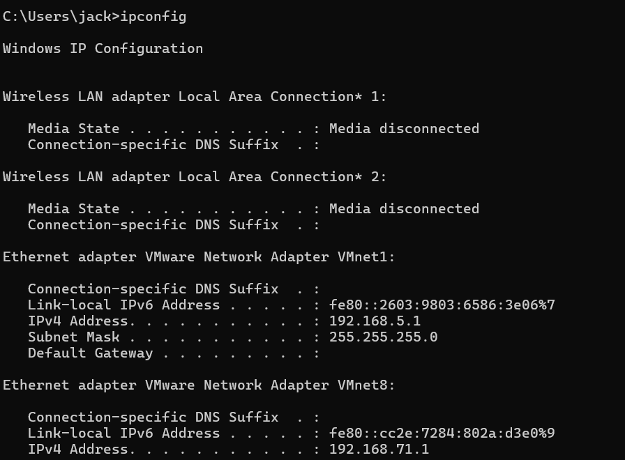

**Ping Localhost:**

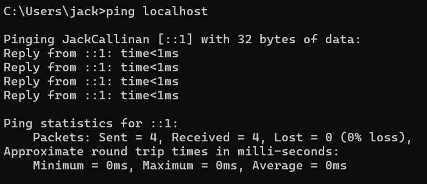

**Netstat:**

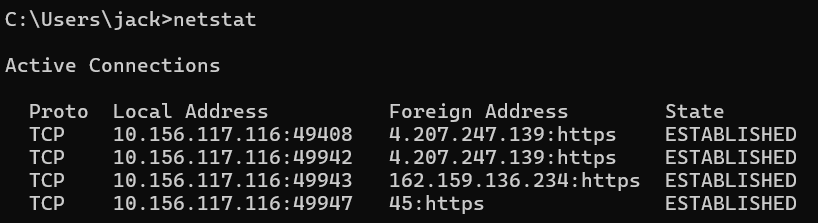
