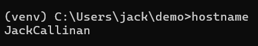

**Hostname Running:**

**Env Running:**

**PS Running:**

**PWD Running:**

**Git Clone:**

**Checking IOT:**

**DF:**

**Making Demo:**

**File2:**

**Uname:**

**IPCONFIG:**

**Ping Localhost:**

**Netstat:**

