**Julian Running:**

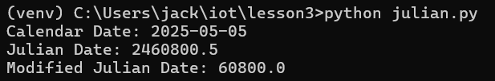

**Date_example Running:**

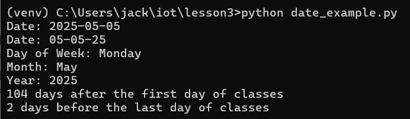

**Datetime_example Running:**

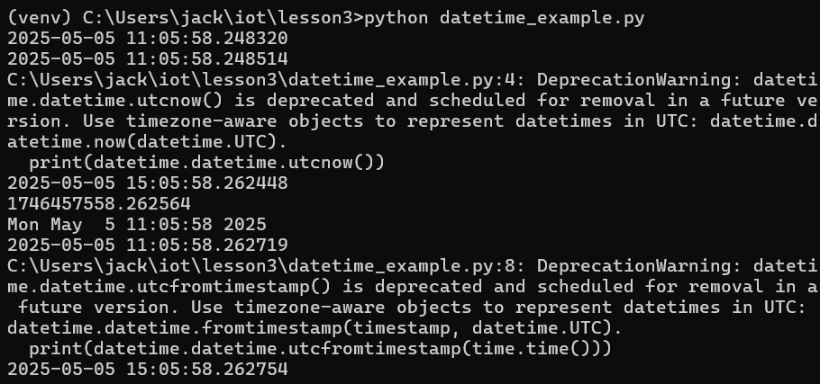

**Time_example Running:**

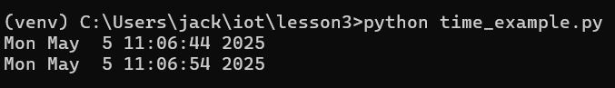

**Sun.py Running:**

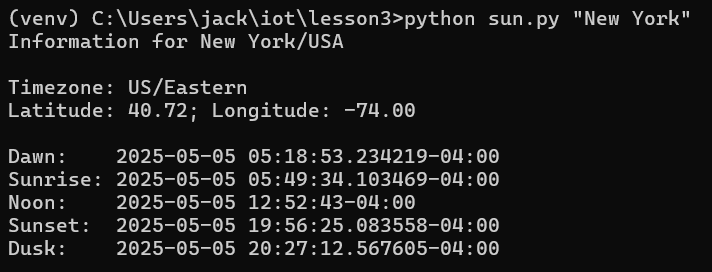

**Moon.py Running:**

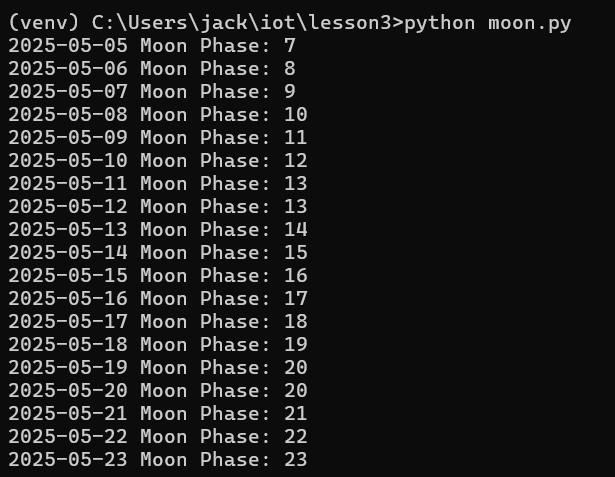

**Coord.py Running:**

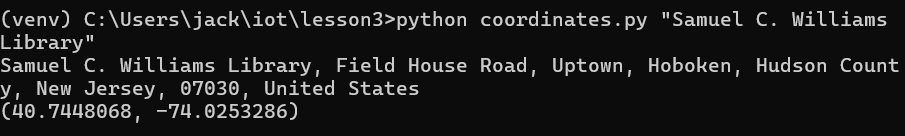

**Address.py Running:**

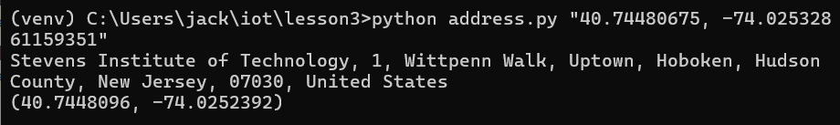

**CPU.py Running:**

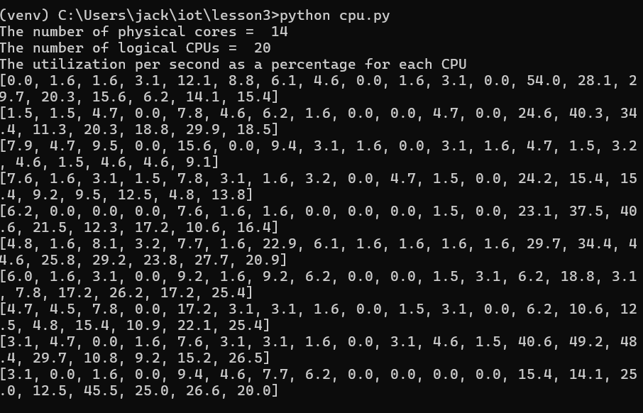

**Battery.py Running:**

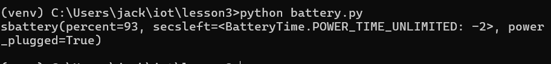

**Docstat Running:**

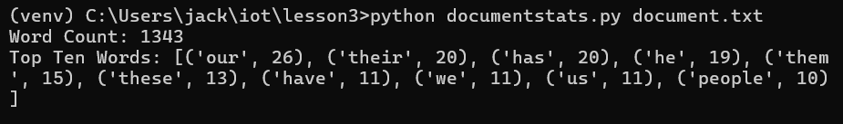
